# NEU Library Log

**Digital Entry Management System for Nueva Era University Library**


- **Live URL:** [neu-library-log-nine.vercel.app](https://neu-library-log-nine.vercel.app)
- **GitHub Repository:** [github.com/ReiCanete/NEU-Library-Log](https://github.com/ReiCanete/NEU-Library-Log)

---

## 📖 Overview

The **NEU Library Log** is a professional digital visitor management system designed for the Nueva Era University Library. It replaces traditional paper-based logs with a high-performance digital kiosk, providing real-time analytics for library staff and a seamless entry experience for students.

---

## ✨ Features

### 🖥️ Kiosk (Visitor-Facing)
- **Smart ID Entry:** Optimized for manual input with automatic dash formatting (`XX-XXXXX-XXX`).
- **Institutional Authentication:** Secure sign-in via Google restricted to `@neu.edu.ph` domains.
- **Visitor Registration:** First-time registration with name validation and automatic word capitalization.
- **Visit Purpose Selection:** Large, touch-friendly cards for selecting library activities.
- **Welcome Display:** Personalized entry confirmation with an 8-second auto-reset timer.
- **Broadcast System:** Floating announcement toasts (Gold for notices, pulsing Red for urgent alerts).
- **Session Protection:** Automatic 3-minute idle timeout to protect visitor privacy.
- **Admin Role Select:** Staff signing in at the kiosk can choose between logging a visit or entering the portal.

### 🛡️ Admin Panel (Staff-Facing)
- **Live Dashboard:** Real-time metrics banner, top visit purposes, and visitor trend visualizations.
- **Visitor Logs:** Searchable activity history with a detailed side panel for visitor profiles and history.
- **Registry Management:** Full list of registered users with options to edit or remove profiles.
- **Proactive Security:** Managed blocklist to immediately restrict access to specific IDs.
- **System Reporting:** Official PDF and CSV export engines featuring institutional NEU branding.
- **Broadcast Center:** Command center for posting scheduled or urgent library announcements.

---

## 🛠 Tech Stack

| Category | Technology |
| :--- | :--- |
| **Framework** | Next.js 15 (App Router) |
| **Language** | TypeScript |
| **Styling** | Tailwind CSS & ShadCN UI |
| **Database** | Firebase Firestore (Spark/Free Tier) |
| **Authentication** | Firebase Auth (Google OAuth @neu.edu.ph) |
| **Charts** | Recharts |
| **PDF Export** | jsPDF & autoTable |
| **Deployment** | Vercel |

---

## 📂 Firestore Collections

### `users`
- Stores visitor profiles (Student ID, Full Name, College, Program, Email, Role).
- Roles are restricted to `visitor` and `admin`.

### `visits`
- Real-time log of every entry (Student ID, Full Name, Purpose, Login Method, Timestamp).

### `blocklist`
- Records of restricted individuals (Student ID, Reason, Admin who blocked, Timestamp).

### `announcements`
- Broadcast messages (Content, Priority, Active Status, Date Range).

---

## 🚀 Setup and Installation

1. **Clone the repository:**
   ```bash
   git clone https://github.com/ReiCanete/NEU-Library-Log.git
   cd NEU-Library-Log
   ```

2. **Install dependencies:**
   ```bash
   npm install
   ```

3. **Environment Configuration:**
   Create a `.env.local` file in the root directory:
   ```env
   NEXT_PUBLIC_FIREBASE_API_KEY=your_api_key
   NEXT_PUBLIC_FIREBASE_AUTH_DOMAIN=your_auth_domain
   NEXT_PUBLIC_FIREBASE_PROJECT_ID=your_project_id
   NEXT_PUBLIC_FIREBASE_STORAGE_BUCKET=your_storage_bucket
   NEXT_PUBLIC_FIREBASE_MESSAGING_SENDER_ID=your_sender_id
   NEXT_PUBLIC_FIREBASE_APP_ID=your_app_id
   ```

4. **Run development server:**
   ```bash
   npm run dev
   ```

---

## 📸 Screenshots

### Kiosk Workflow
| | |
|:---:|:---:|
| 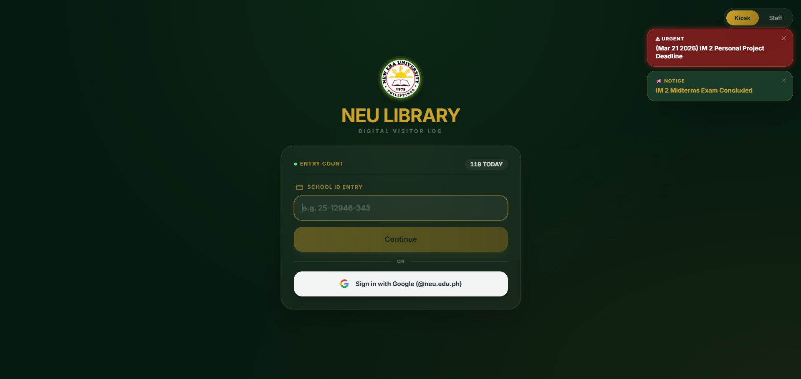 <br> *Kiosk Entry* | 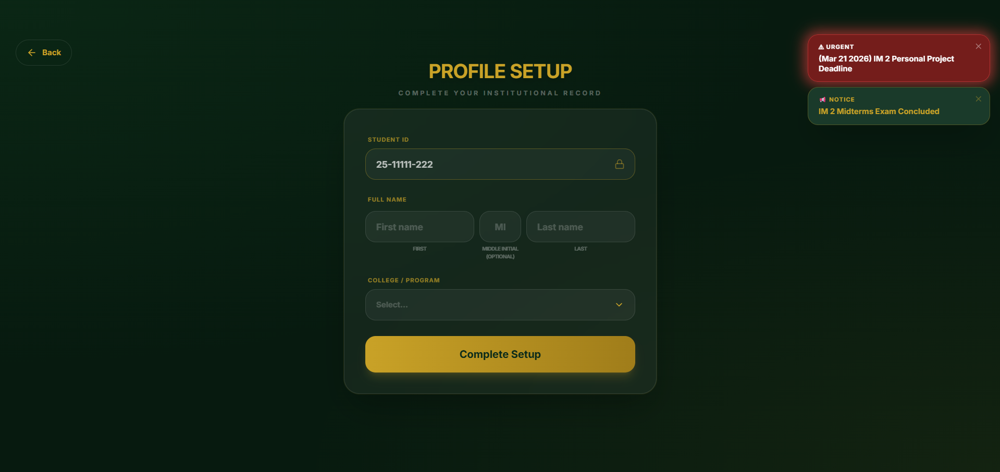 <br> *Visitor Registration* |
| 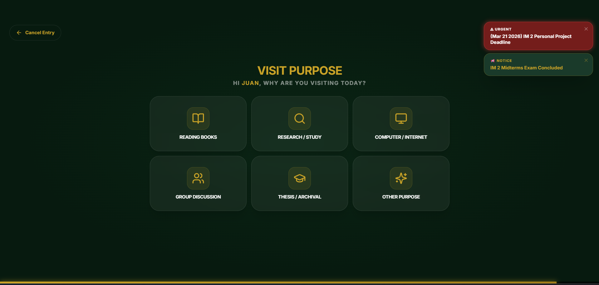 <br> *Purpose Selection* | 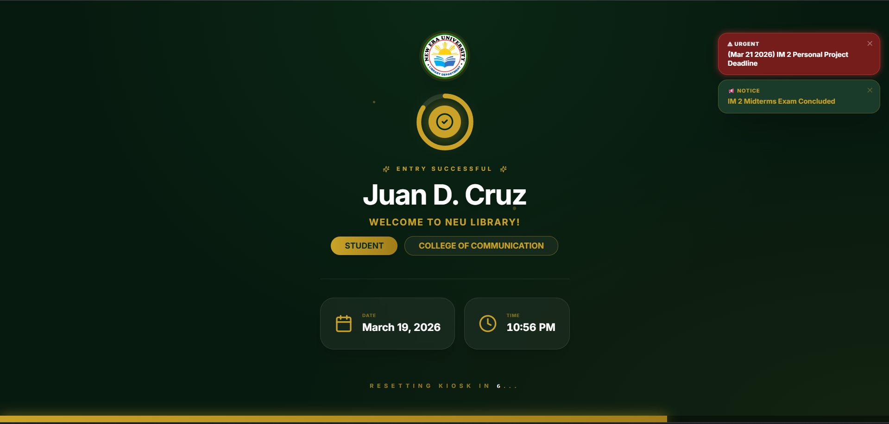 <br> *Entry Successful* |

### Administrative Portal
| | |
|:---:|:---:|
| 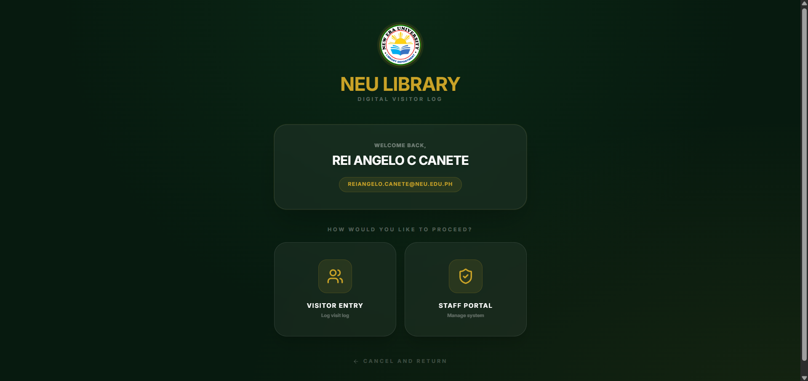 <br> *Staff Sign-in* | 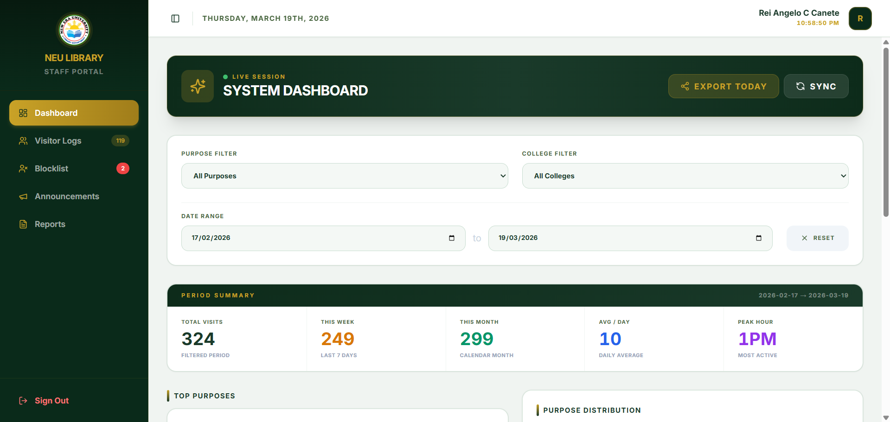 <br> *Live Analytics* |
| 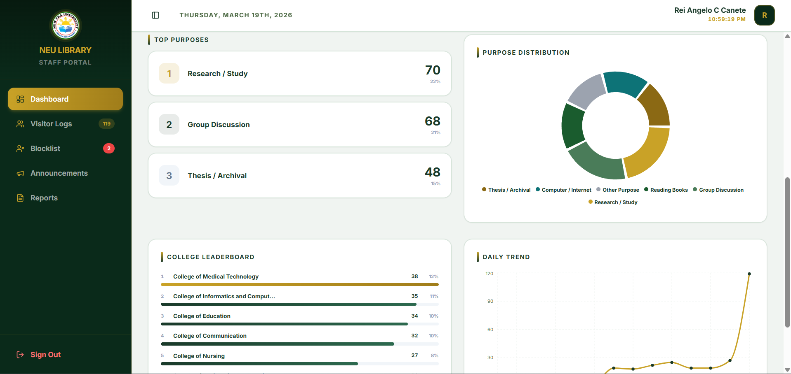 <br> *Purpose Distribution* | 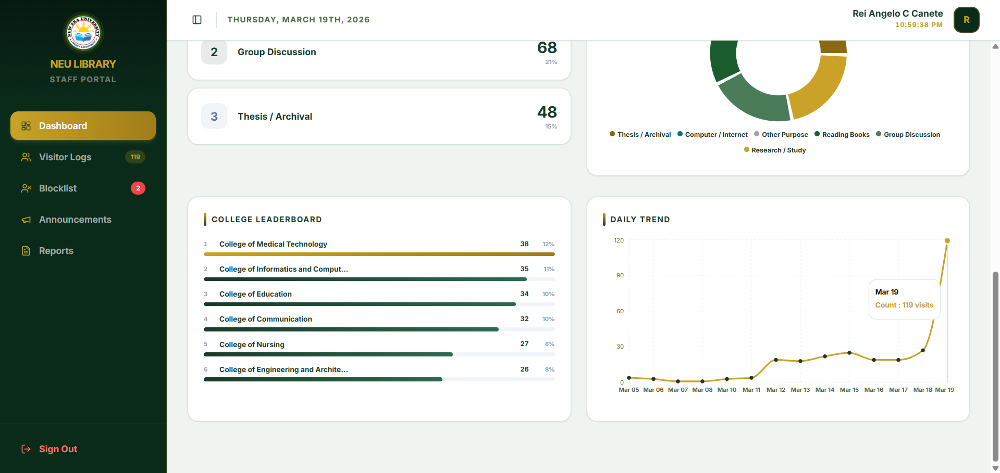 <br> *Daily Trends* |
| 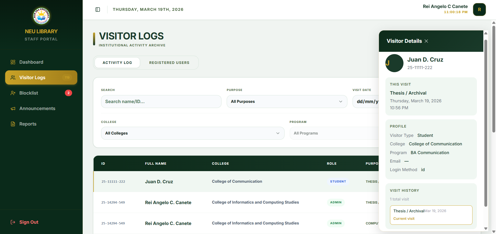 <br> *Activity Logs* | 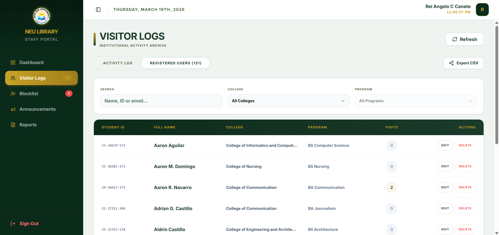 <br> *Registered Users* |
| 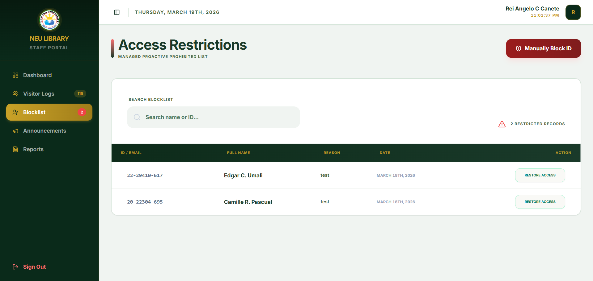 <br> *Access Restrictions* | 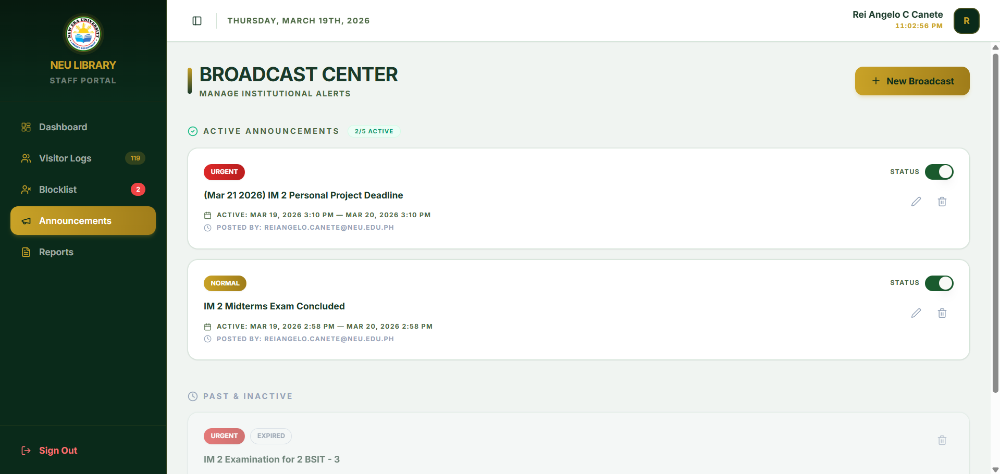 <br> *Broadcast Center* |
| 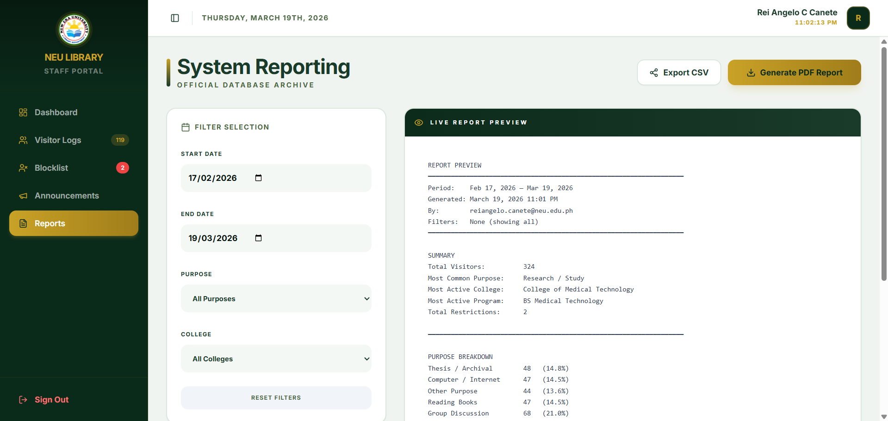 <br> *Report Generation* | 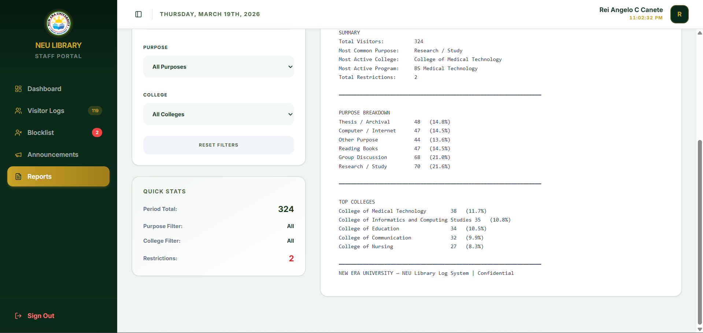 <br> *PDF Preview* |

---

## ⚠️ Known Limitations
- **Mobile Compatibility:** The system is optimized for kiosk displays and desktop admin use; responsiveness for mobile devices is not yet fully verified.
- **Admin Access:** Administrative roles must be manually assigned within the Firestore `users` collection by setting the `role` field to `"admin"`.

---

## 🎓 Credits
Developed for the **Nueva Era University Library** as a modern digital entry solution. Built with excellence using Next.js and Firebase.